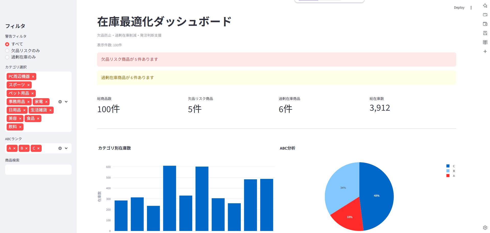
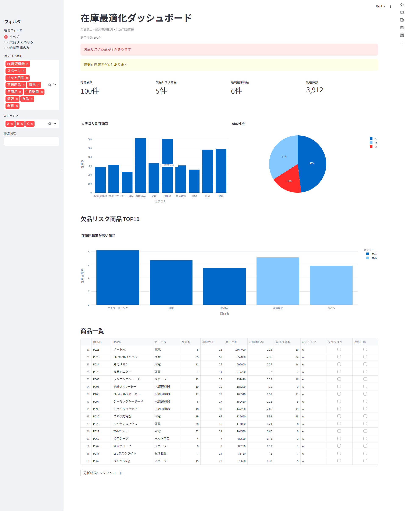

# Inventory Optimization Dashboard（在庫最適化ダッシュボード）

  
   
  <em>▲ 在庫状況・欠品リスク・ABC分析を可視化したダッシュボード</em>

## デモ
ブラウザから実際に操作できます  
https://inventory-dashboard-python.streamlit.app/

## 概要

商品ごとの在庫データを分析し、

- 欠品リスク
- 過剰在庫
- 発注推奨数
- 在庫回転率
- ABC分析

を可視化する在庫分析ダッシュボード（Python × Streamlit）です。  
業務における「在庫管理の見える化」と「発注判断支援」をテーマに制作しました。

サイドバーのフィルタ機能により、カテゴリ別・ABCランク別の分析や、欠品リスク商品の絞り込み・商品検索をリアルタイムで行えます。

## 開発背景（DXの視点）

在庫管理業務では、

- 欠品による販売機会損失
- 過剰在庫による保管コスト増加
- 発注判断の属人化

といった課題があります。

本ダッシュボードでは、

**「在庫データを可視化し、問題商品を即座に発見できる環境を作る」**

ことを目的として開発しました。

社内SE・DX推進業務を意識した設計とし、  
「問題商品をひと目で把握、即座に意思決定できる業務アプリ」を目指しました。

## 主な機能

- **データ入出力**：CSVデータ読込 / 分析結果CSVダウンロード
- **在庫分析**：欠品リスク分析 / 過剰在庫分析 / 在庫回転率分析 / ABC分析
- **発注支援**：発注推奨数計算
- **UI**：KPIカード表示 / グラフ可視化 / 商品検索 / フィルタ機能

📸 画面全体のスクリーンショットを見る

  
   
  <em>▲ カテゴリ別在庫数・ABC分析・欠品リスク商品の可視化</em>

## 工夫したポイント

### 欠品リスクを優先表示

実務では「問題のある商品を素早く見つける」ことが重要と考え、欠品リスクや過剰在庫を画面上部へ警告表示する構成にしています。

### フィルタによる業務効率化

サイドバーに警告フィルタ・カテゴリフィルタ・ABCランクフィルタ・商品検索を実装し、担当者が必要な情報へ素早くアクセスできるよう設計しました。

### ABC分析による重点商品管理

売上累積比率を利用したABC分析を実装し、主力商品・準主力商品・低優先商品を可視化しています。

### ファイル分割による保守性向上

機能ごとにファイルを分割し、保守しやすい構成を意識しました。

## 使用技術

### Language
- Python 3.x

### Web Framework
- Streamlit

### Data Analysis
- pandas

### Visualization
- Plotly Express

## ポートフォリオ
https://portfolio-site-lilac-one.vercel.app/
